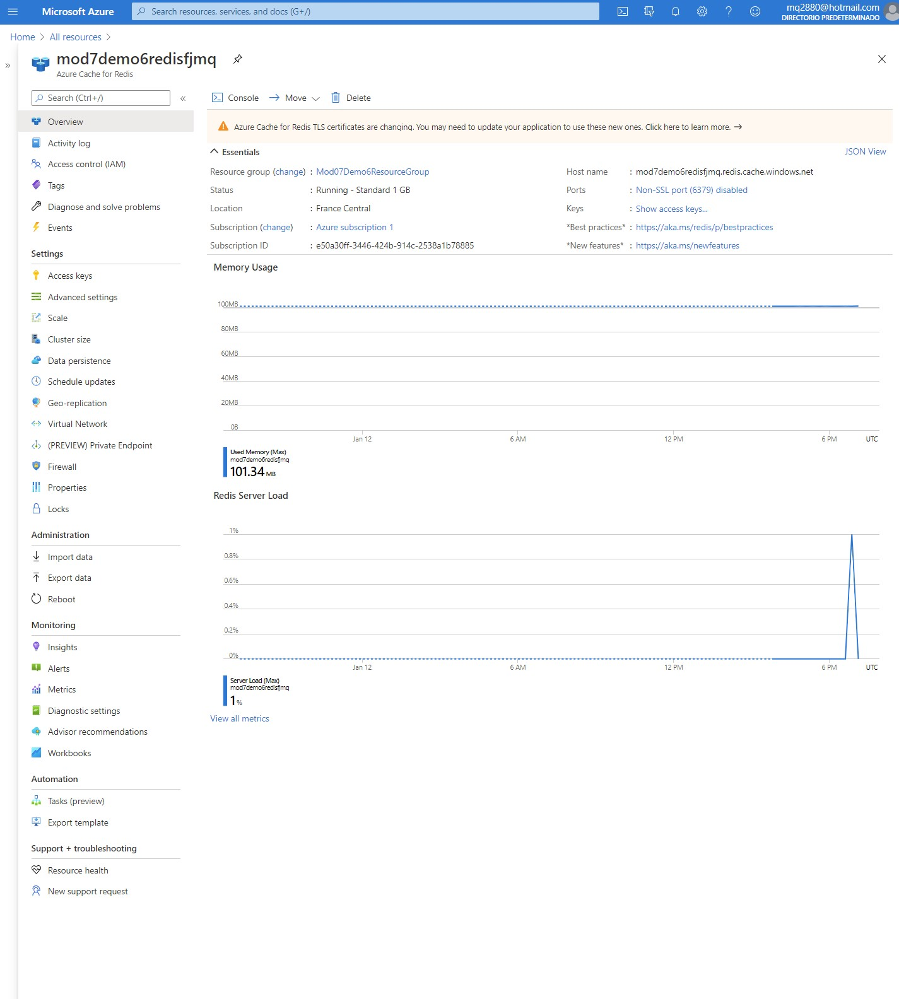
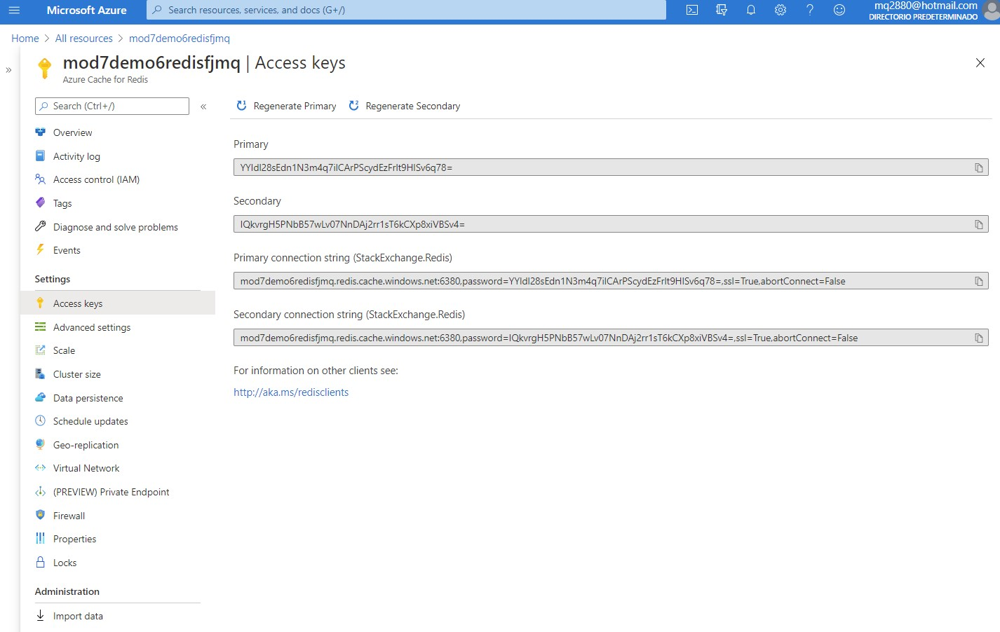
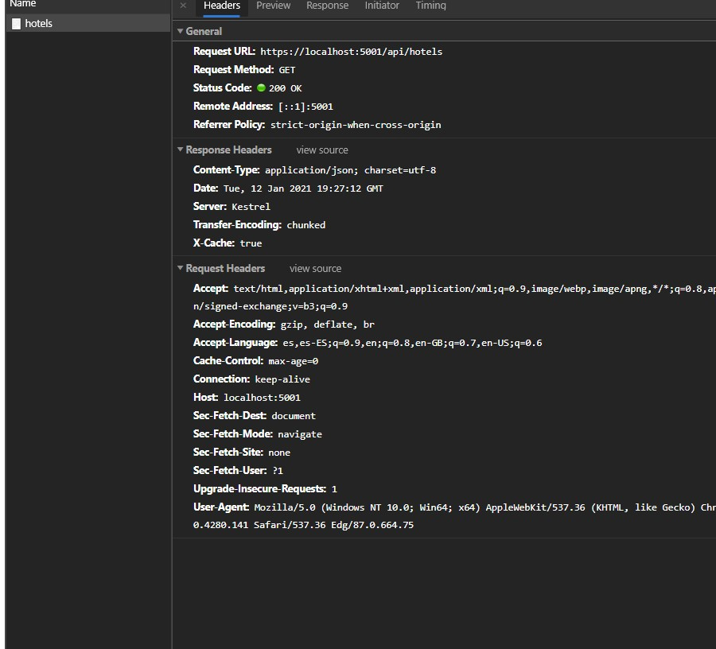
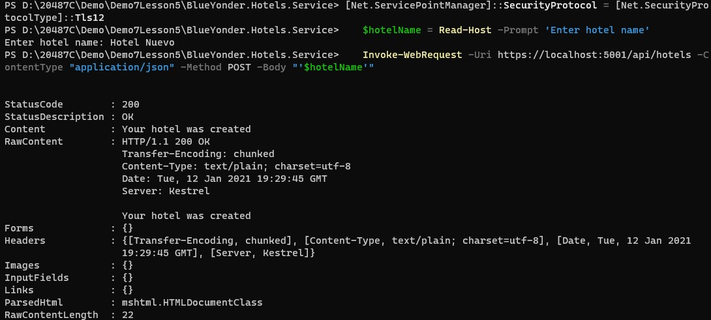
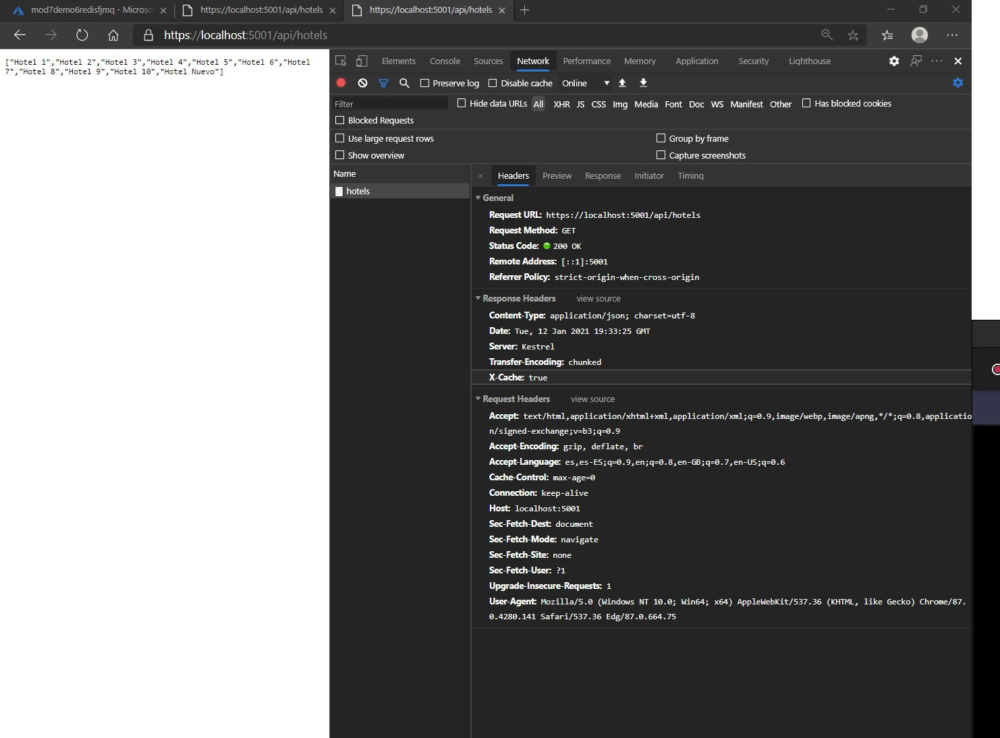

# Module 7: Implementing data storage in Azure

# Lesson 5: Scaling with Out-of-Process Cache

### Demonstration: Using Microsoft Azure Redis Cache for Caching Data

#### Demonstration Steps

- Creamos una Azure Cache for Redis con el nombre **mod7demo6redisfjmq**

  

  


- Copiamos la clave **StackExchange.Redis**

  

- Abrimos el proyecto **Mod7Demo6Redis**

- EN el **appsettings.json** pegamos la clave

- EJecutamos

- comprobamos con la siguiente URL:

  ```url
  https://localhost:5001/api/hotels
  ```
  
  Y verificamos despues de actualizar que el x-cache esta true
  
  
  
  
  
- añadimos un nuevo hotel

   ```bash
   [Net.ServicePointManager]::SecurityProtocol = [Net.SecurityProtocolType]::Tls12
   $hotelName = Read-Host -Prompt 'Enter hotel name' 
   Invoke-WebRequest -Uri https://localhost:5001/api/hotels -ContentType "application/json" -Method POST -Body "'$hotelName'"
   ```



- Comprobamos nuevamente en el navegador refrescando

  